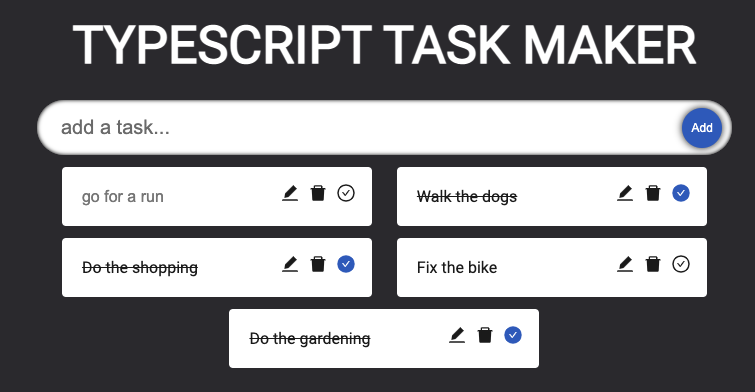
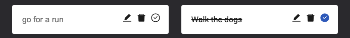

# The Typescript & React Task Maker

So here we are. The first React/Typescript personal project. In true learning fashion I've had another go at making a todo list to apply the typescript skills.



It is a CRUD application. So you can create, read, update and delete todos. The main focus is on getting my hands on Typescript. However, this didn't stop me learning some cool react skills at the same time.

The input bar is autofocused, so you can instantly write another todo upon submission.

The icons are imported from the react icon library. This is the first time I've used it.

If you click the 'tick' icon, it will conditionally render a filled equivalent and put a line through the text.



## Setup and usage

You can give this app a go yourself. Once you've cloned or forked the repo, run the following to install dependencies:

```
npm i
```

Next, run the following to start the app:

```
npm start
```

## Skills used and learned

**Typescript**
- Giving types to functions, variables & props
- creating a reusable interface component
- creating interfaces & type objects for props

**React**
- **Hooks:** useState, useEffect, useRef
- ternary operators & conditional rendering
- **Event handlers**: onClick, onChange, onSubmit
- React Icons Library
- the 's' tag to put a line through text
- seperating components into files
- props & prop drilling

